<!--
  ════════════════════════════════════════════════════════════════════════════
   DEEPAK MOGER · GitHub Profile README
   "Designing ML systems that think and scale."
  ════════════════════════════════════════════════════════════════════════════
-->

  

  <b>Designing ML systems that think — and scale.</b>

  

  <b>Machine Learning Engineer</b> &nbsp;·&nbsp; <b>Data Storyteller</b> &nbsp;·&nbsp; <b>Problem Solver</b>
   
  Turning noisy data into decisions, predictions, and production-ready intelligence.

  
  
  
  
  

  
  
  

  
  
  
  

---

## Table of Contents

1. [The Manifesto](#the-manifesto)
2. [About Me](#about-me)
3. [Snapshot](#snapshot)
4. [Open to Work](#open-to-work)
5. [Currently Learning](#currently-learning)
6. [Operating Principles](#operating-principles)
7. [The Engineer's Mental Model](#the-engineers-mental-model)
8. [Core Tech Stack](#core-tech-stack)
9. [System Architecture Lens](#system-architecture-lens)
10. [What I'm Building Right Now](#what-im-building-right-now)
11. [The ML Lifecycle I Live By](#the-ml-lifecycle-i-live-by)
12. [Skills Atlas](#skills-atlas)
13. [Spotlight: Drift Hunter](#spotlight-drift-hunter)
14. [GitHub Stats](#github-stats)
15. [Pinned Projects](#pinned-projects)
16. [Featured Projects](#featured-projects)
17. [Workflow & Tooling Rituals](#workflow--tooling-rituals)
18. [Reading Shelf](#reading-shelf)
19. [Connect](#connect)
20. [Closing Note](#closing-note)

---

## The Manifesto

> Data does not lie — but it *whispers*, *contradicts*, and occasionally *theatrically deceives*. The job of a Machine Learning Engineer is not to bow before its mystique, but to **listen carefully, validate ruthlessly, and translate honestly**.

I build ML systems the way a watchmaker builds a movement: every gear is justified, every tolerance is measured, and nothing — *nothing* — moves without earning its place. Models are not magic. They are **disciplined approximations of reality**, and the engineer's craft lies in keeping that approximation honest under the messy weight of production.

When I encounter a 0.99 accuracy on the first training run, I do not celebrate. I open a forensic investigation.

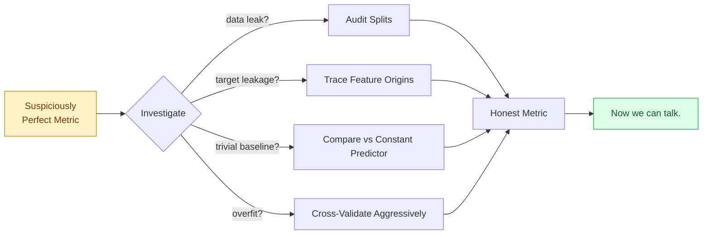

---

## About Me

I am a Machine Learning Engineer with a stubborn affection for **problems that resist easy answers** — the kind where the data is noisy, the stakeholders disagree on the metric, and the literature offers four contradictory approaches. That ambiguity is where the real engineering lives.

My work tends to orbit three gravitational themes:

- **Predictive systems** that earn their probabilities through calibration, not coincidence.
- **NLP and multimodal pipelines** that turn human signals into machine-actionable structure.
- **Anomaly and drift detection** that catches the world quietly *changing shape* before the dashboard turns red.

I write models as if they will be on-call at 3 AM — because eventually, one of them will be.

> **Current status:** refining the signal, filtering the noise, and politely arguing with my own loss curves.

---

## Snapshot

| Dimension | The Short Version |
|---|---|
| **Role** | Machine Learning Engineer focused on applied AI and data products |
| **Strengths** | Predictive modeling, NLP systems, anomaly detection, drift monitoring |
| **Build Style** | Research-backed experimentation with production-first execution |
| **Mental Model** | Data is the territory; the model is the map; never confuse the two |
| **Failure Mode I Hunt** | Silent degradation — the model that *looks* fine but quietly stops working |
| **Collaboration** | Open to full-time roles, freelance projects, and high-impact builds |
| **Time Zone** | India Standard Time (IST, UTC+5:30) — asynchronous-friendly |

---

## Open to Work

I am actively exploring opportunities where the problem is genuine, the data is interesting, and the bar is high:

- **Machine Learning Engineer** roles — applied research through production deployment
- **AI Engineer** and **Applied Scientist** positions — model design and evaluation
- **Freelance collaborations** in NLP, computer vision, and predictive analytics
- **Hackathons**, **research collaborations**, and **open-source AI builds**
- **Technical writing** opportunities — translating ML mechanics for engineers and decision-makers

If your team is fighting a fundamentally interesting data problem, I want to hear about it.

---

## Currently Learning

The field moves fast; standing still is regression. My current study queue:

- **Advanced LLM fine-tuning** — LoRA, QLoRA, DPO, and the evaluation harnesses that keep them honest
- **MLOps maturity** — model monitoring, drift detection, governance, and the unglamorous plumbing that keeps systems alive
- **Real-time multimodal AI** — low-latency inference across speech, text, and vision modalities
- **Causal inference foundations** — because correlation has been getting away with too much for too long
- **System design for ML platforms** — feature stores, online/offline parity, and reproducibility at scale

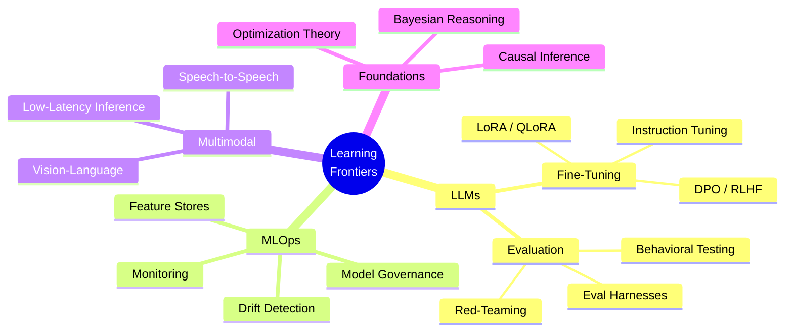

---

## Operating Principles

These are the laws I refuse to compromise on. They were learned the expensive way.

1. **Reproducibility is a feature, not a virtue.** A result you cannot reproduce is a rumor.
2. **The baseline is sacred.** If your fancy model cannot beat a logistic regression, the problem is not the model.
3. **Validate before you celebrate.** Test sets are not for trophies; they are for cross-examination.
4. **Optimize the metric the business actually pays for.** F1 is not always your friend.
5. **Calibration over confidence.** A 70% probability should mean 70% — not "the model is feeling assertive today."
6. **Drift is not an event; it is a weather pattern.** Plan for it.
7. **Production is the only ground truth.** Notebooks lie. Logs do not.
8. **Document the failures louder than the successes.** Future-you will thank present-you.

---

## The Engineer's Mental Model

How I move from a vague business question to a system that delivers measurable outcomes:

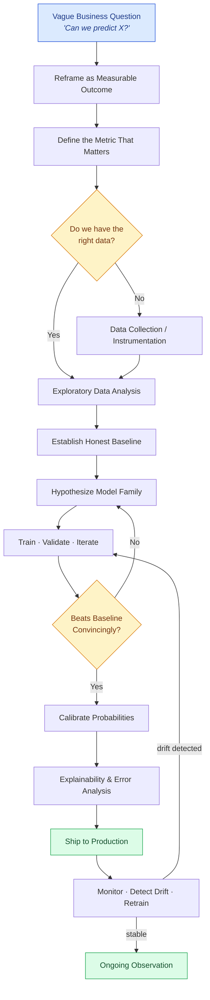

This loop is not academic — it is the *load-bearing wall* of every project I ship.

---

## Core Tech Stack

  

  
  
  

### The Toolbelt, Categorized

| Layer | Tools I Reach For | Why It Earns Its Place |
|---|---|---|
| **Language** | Python, SQL | Python for orchestration and modeling; SQL because data lives in databases, not dreams |
| **Numerical Core** | NumPy, Pandas, SciPy | The bedrock — vectorization is non-negotiable |
| **Classical ML** | Scikit-learn, XGBoost, LightGBM | Where tabular problems get solved with elegance |
| **Deep Learning** | PyTorch, TensorFlow | PyTorch for research velocity; TF for ecosystem reach |
| **NLP & Speech** | NVIDIA Riva, Hugging Face Transformers | Production-grade speech and language pipelines |
| **Computer Vision** | OpenCV, torchvision | From classical CV to modern architectures |
| **Storage** | PostgreSQL, MySQL, MongoDB | Relational when structure matters; document when it does not |
| **Ops** | Docker, Git, Linux | Containerize early, version everything, live in the terminal |
| **Visualization** | Matplotlib, Seaborn, Plotly | The story is only as good as the chart that tells it |

---

## System Architecture Lens

A reference picture of how I think about ML systems end-to-end — the kind I build and the kind I want to help build:

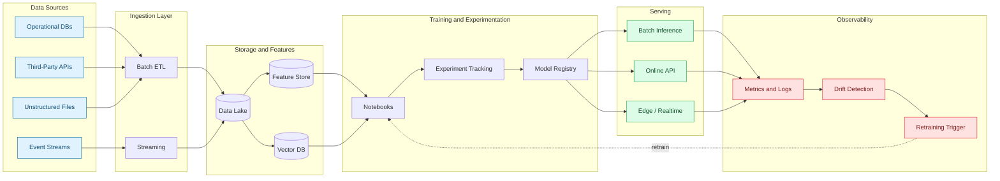

---

## What I'm Building Right Now

A working portfolio of in-flight projects — each one chosen because the problem refuses to be solved with a one-liner.

### 1. Match Outcome Prediction · *Calibrated Forecasting*

Building probability models for sports outcomes where *being right on average* is not enough — the **probabilities themselves must be trustworthy**. A 65% prediction should win roughly 65 times out of 100. Anything less is theater.

- **Focus:** Calibration over raw accuracy
- **Approach:** Gradient-boosted ensembles plus isotonic / Platt calibration
- **Validation:** Reliability diagrams, Brier scores, and out-of-time backtests

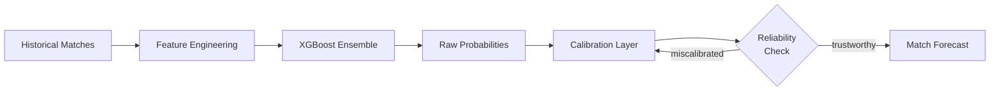

### 2. Real-Time Voice-to-Voice Translation · *Conversational Latency*

A pipeline that takes a spoken sentence in one language and returns it in another **fast enough to feel like a conversation**, not a transaction.

- **Stack:** NVIDIA Riva for ASR plus TTS, custom translation routing
- **Constraint:** End-to-end latency below the conversational tolerance threshold
- **Hard problem:** Preserving prosody and intent across the translation boundary

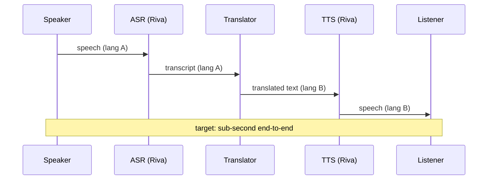

### 3. AI-Powered Cloud Drift Detection · *Adaptive Monitoring*

Rule-based monitors are brittle: they catch the failures you predicted and miss the ones you did not. This project replaces static thresholds with **adaptive anomaly detection** that learns the cloud environment's normal shape and flags genuine deviation.

- **Algorithms:** Isolation forests, autoencoders, and statistical change-point detection
- **Inputs:** Cloud API telemetry across compute, storage, and network primitives
- **Output:** Ranked drift alerts with explanations, not screaming sirens

### 4. Restaurant Rating Intelligence · *Regression with a Story*

A regression pipeline that explains **what actually drives a five-star rating** — not just which features correlate, but which ones the data can defend as meaningful.

- **Techniques:** Feature importance, SHAP attribution, partial dependence
- **Deliverable:** A narrative that a non-ML stakeholder can act on

---

## The ML Lifecycle I Live By

Most ML lifecycle diagrams are linear and lying. The real lifecycle is a **state machine with loops, regressions, and graceful degradation**:

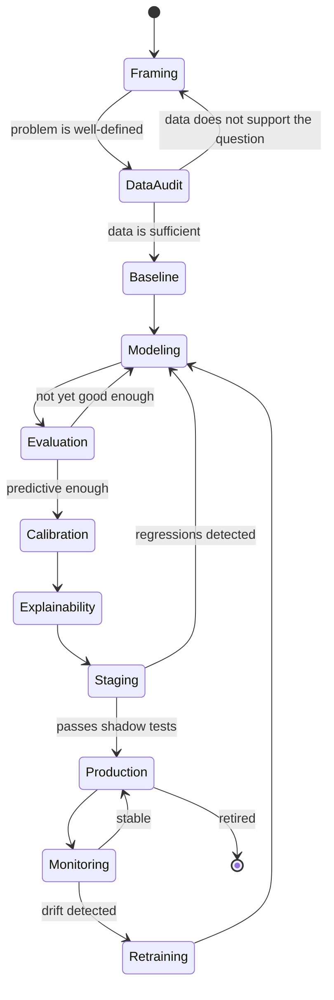

Every arrow above represents a decision I have made — and a few I have learned to make differently the second time.

---

## Skills Atlas

A topographical view of where my craft lives, organized by domain rather than buzzword density.

### Data and Analytics
- **Python:** Pandas, NumPy, idiomatic vectorization, memory-conscious pipelines
- **SQL:** Window functions, CTEs, query plan reading, index intuition
- **NoSQL:** MongoDB document modeling, denormalization trade-offs
- **Cleaning and preprocessing:** Missingness diagnosis, encoding strategies, leakage prevention
- **Visualization:** Matplotlib, Seaborn — charts that argue, not decorate
- **Exploratory Data Analysis:** Hypothesis-first EDA, not blind plotting

### Machine Learning and AI
- **Scikit-learn:** Pipelines, custom transformers, cross-validation design
- **TensorFlow and PyTorch:** Custom training loops, mixed precision, distributed basics
- **Ensembles:** Random Forest, XGBoost, LightGBM, stacking with discipline
- **NLP:** Tokenization, embeddings, transformer fine-tuning, **NVIDIA Riva**
- **Computer Vision:** Augmentation strategies, transfer learning, CNN architectures
- **LLM fine-tuning:** Instruction tuning, parameter-efficient adaptation, evaluation rigor

### Engineering and Research
- **Model evaluation:** Beyond accuracy — calibration, fairness slices, robustness probes
- **Drift monitoring:** Population stability, KS tests, embedding drift, concept drift
- **Statistical reasoning:** Hypothesis testing without ritual, confidence with humility
- **Linear algebra intuition:** Eigenvalues you can feel, not just compute
- **Experiment tracking:** Reproducibility as a first-class citizen
- **Research writing:** Technical communication that respects the reader's time
- **Deployment fundamentals:** Containerization, versioning, rollback strategy

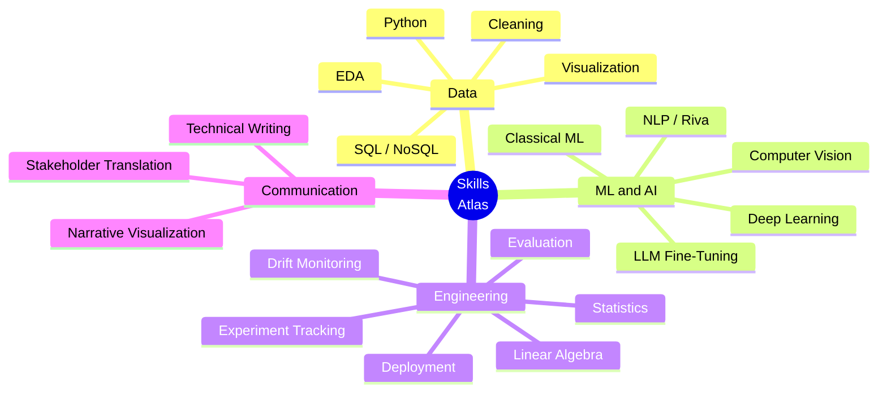

---

## Spotlight: Drift Hunter

> *Cloud Infrastructure Drift Detection — because rule-based monitors are flashlights, and modern infrastructure is a forest.*

### The Premise

Cloud infrastructure does not break in clean, predictable ways. It **drifts** — a configuration changes here, a permission widens there, a network rule mutates somewhere else — and the cumulative effect is an environment that no longer matches its intended state. By the time a rule-based monitor catches it, the incident is already on the timeline.

**Drift Hunter** is a research-driven approach that replaces brittle thresholds with **AI-based anomaly detection**, learning the environment's baseline behavior and flagging deviations *before* they become outages.

### Why This Matters

| The Old Way | The Drift Hunter Way |
|---|---|
| Static rules that age poorly | Adaptive models that learn the environment |
| Alert fatigue from threshold noise | Ranked, explainable anomaly signals |
| Reactive — you find out when it breaks | Proactive — you find out when it *starts* to break |
| Maintained by tribal knowledge | Maintained by retraining cadence |

### How It Thinks

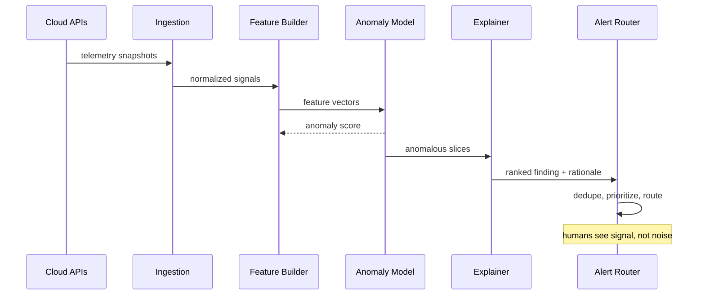

### Core Stack

- **Language:** Python
- **Data:** Cloud provider APIs and telemetry snapshots
- **Models:** Isolation forests, autoencoders, statistical change-point methods
- **Output:** Ranked, explainable drift findings with actionable context

### Research Posture

This project is deliberately **research-flavored production code** — every modeling choice is justified, every metric is interrogated, and every alert is required to *explain itself*. Black-box anomaly scores are useless to an on-call engineer at 2 AM; ranked, contextualized findings are not.

---

## GitHub Stats

  <picture>
    <source media="(prefers-color-scheme: dark)" srcset="https://github-readme-stats.vercel.app/api?username=Deepak-moger&show_icons=true&theme=tokyonight&hide_border=true"/>
    <source media="(prefers-color-scheme: light)" srcset="https://github-readme-stats.vercel.app/api?username=Deepak-moger&show_icons=true&theme=default&hide_border=true"/>
    
  </picture>
  <picture>
    <source media="(prefers-color-scheme: dark)" srcset="https://github-readme-stats.vercel.app/api/top-langs/?username=Deepak-moger&layout=compact&theme=tokyonight&hide_border=true"/>
    <source media="(prefers-color-scheme: light)" srcset="https://github-readme-stats.vercel.app/api/top-langs/?username=Deepak-moger&layout=compact&theme=default&hide_border=true"/>
    
  </picture>

  <picture>
    <source media="(prefers-color-scheme: dark)" srcset="https://github-readme-streak-stats.herokuapp.com/?user=Deepak-moger&theme=tokyonight&hide_border=true"/>
    <source media="(prefers-color-scheme: light)" srcset="https://github-readme-streak-stats.herokuapp.com/?user=Deepak-moger&theme=default&hide_border=true"/>
    
  </picture>

  <picture>
    <source media="(prefers-color-scheme: dark)" srcset="https://github-readme-activity-graph.vercel.app/graph?username=Deepak-moger&theme=github-dark&hide_border=true&area=true"/>
    <source media="(prefers-color-scheme: light)" srcset="https://github-readme-activity-graph.vercel.app/graph?username=Deepak-moger&theme=github-light&hide_border=true&area=true"/>
    
  </picture>

---

## Pinned Projects

  
  

  
  

---

## Featured Projects

A curated cross-section of the work — each project sits at a different intersection of ML, engineering, and product thinking.

<table>
  <tr>
    <td width="50%" valign="top">
      <h3>ArcSense</h3>
      
<b>The Idea:</b> A TypeScript system for orchestrating structured intelligence workflows — pipelines where each stage is typed, traceable, and composable.

      
<b>Why It Is Interesting:</b> Most intelligence pipelines are loose chains of scripts. ArcSense argues for <i>structured</i>, type-safe orchestration where failures are caught at compile time, not in production.

      
<b>Stack:</b> TypeScript

      
<a href="https://github.com/Deepak-Moger/ArcSense">View Repository &rarr;</a>

    </td>
    <td width="50%" valign="top">
      <h3>Dream11Oracle</h3>
      
<b>The Idea:</b> A fantasy sports prediction engine designed for <i>decision-ready</i> ML outputs — calibrated probabilities, not vibes.

      
<b>Why It Is Interesting:</b> Fantasy sports are a near-perfect testbed for calibration: small probability differences compound into very real outcomes, so the metric you optimize must match the decision being made.

      
<b>Stack:</b> Python

      
<a href="https://github.com/Deepak-Moger/Dream11Oracle">View Repository &rarr;</a>

    </td>
  </tr>
  <tr>
    <td width="50%" valign="top">
      <h3>IPLOracle</h3>
      
<b>The Idea:</b> Cricket outcome forecasting using historical signals, trend modeling, and conditional context — venue, weather proxies, team form, and matchup dynamics.

      
<b>Why It Is Interesting:</b> Cricket is rich in <i>structured chaos</i> — perfect for engineered features and ensemble models that respect the game's conditional nature.

      
<b>Stack:</b> Jupyter Notebook · Python

      
<a href="https://github.com/Deepak-Moger/IPLOracle">View Repository &rarr;</a>

    </td>
    <td width="50%" valign="top">
      <h3>AIHEALTH-NAVIGATOR</h3>
      
<b>The Idea:</b> An AI healthcare assistant concept for guided, conversational symptom triage and information support.

      
<b>Why It Is Interesting:</b> Healthcare AI lives or dies on <i>safety scaffolding</i> — knowing when not to answer is as important as knowing when to. This project is an exploration of those guardrails.

      
<b>Stack:</b> Python

      
<a href="https://github.com/Deepak-Moger/AIHEALTH-NAVIGATOR">View Repository &rarr;</a>

    </td>
  </tr>
  <tr>
    <td width="50%" valign="top">
      <h3>agent-automotive</h3>
      
<b>The Idea:</b> Real-time AI agents that reduce breakdown risk and improve service planning by reasoning over vehicle telemetry.

      
<b>Why It Is Interesting:</b> Predictive maintenance is one of the highest-ROI applications of ML, and agentic patterns offer a path to <i>contextual</i> recommendations rather than static thresholds.

      
<b>Stack:</b> Python

      
<a href="https://github.com/Deepak-Moger/agent-automotive">View Repository &rarr;</a>

    </td>
    <td width="50%" valign="top">
      <h3>ai-agent-challenge</h3>
      
<b>The Idea:</b> An agentic parser pipeline that extracts structured data from bank statement PDFs — varied layouts, inconsistent formats, real-world mess.

      
<b>Why It Is Interesting:</b> PDFs are the natural enemy of structured data. Solving this elegantly with an agentic approach is a study in <i>graceful degradation</i> and recovery.

      
<b>Stack:</b> Python

      
<a href="https://github.com/Deepak-Moger/ai-agent-challenge">View Repository &rarr;</a>

    </td>
  </tr>
</table>

### Project Landscape

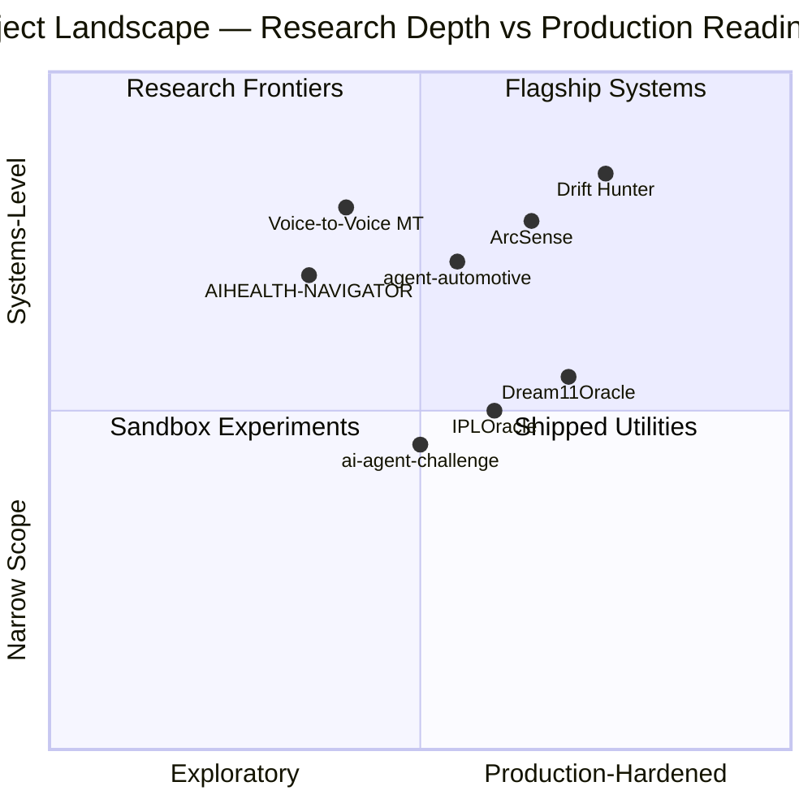

---

## Workflow and Tooling Rituals

The non-glamorous habits that compound into shipped software:

- **Version everything.** Code, data lineage, model artifacts, configs. If it influenced a result, it gets a hash.
- **Branch like you mean it.** Feature branches for exploration, clean main, descriptive commits that read like a story.
- **Notebook to script to module.** Prototypes live in notebooks; production lives in versioned modules with tests.
- **Configs in YAML, secrets in vaults.** Never the reverse.
- **Containerize early.** "Works on my machine" is a confession, not a defense.
- **Write tests for the data, not just the code.** Schemas, ranges, nullability — data tests catch what code tests miss.
- **Document the decision, not just the implementation.** Why beats what, every time.

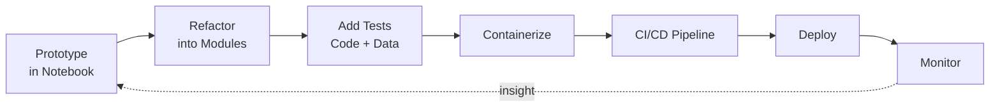

---

## Reading Shelf

A rotating list of texts and resources that keep shaping my craft:

- **"Designing Machine Learning Systems"** — Chip Huyen
- **"Pattern Recognition and Machine Learning"** — Christopher Bishop
- **"The Elements of Statistical Learning"** — Hastie, Tibshirani, Friedman
- **"Reliable Machine Learning"** — Cathy Chen et al.
- **Distill.pub archives** — for visual intuition
- **Papers With Code** — for staying honest about reproducibility
- **The Gradient and Sebastian Ruder's newsletter** — for signal in a noisy field

---

## Connect

  
  

| Channel | Where to Find Me |
|---|---|
| **GitHub** | [github.com/Deepak-moger](https://github.com/Deepak-moger) |
| **LinkedIn** | [linkedin.com/in/deepak-narayan-moger](https://www.linkedin.com/in/deepak-narayan-moger/) |
| **Portfolio** | *Coming soon — under active construction* |
| **Email** | Available via LinkedIn DM |

### What Is a Good Reason to Reach Out?

- You have a dataset that is hiding something, and you want help finding out what.
- You are building an ML system and need a second set of eyes on the design.
- You are launching a project where calibration, drift, or NLP matters and you want a collaborator who treats those words seriously.
- You are hiring for a role where the work is interesting and the bar is high.
- You want to argue — politely — about whether F1 is the right metric. (It usually is not.)

If a model refuses to converge or a dataset refuses to behave, **let's collaborate**.

---

## Closing Note

> *"Data is the new oil, but insight is the refinery."*

The metaphor is overused, but the engineering is not. Refining raw data into trustworthy insight is the entire craft — and the difference between a model that ships and a model that *stays* shipped is the discipline of treating that refinery like critical infrastructure, not a side project.

If you have read this far, you are exactly the kind of person I want to build with.

  

  

